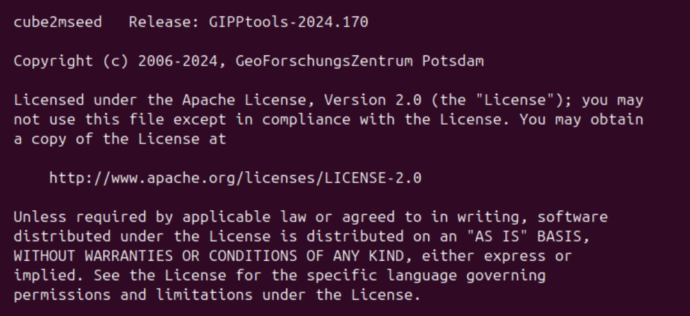

# DIGOS to MiniSEED Converter


## Overview

The **DIGOS to MiniSEED Converter** is a Bash script designed to facilitate the conversion of seismic data files from the DIGOS `.ADD` format into the MiniSEED format using CubeTools. This process ensures that seismic data can be easily analyzed, processed, and visualized using industry-standard tools that support MiniSEED files. 

This script streamlines the conversion process, allowing batch processing of multiple `.ADD` files, and is tailored to support datasets organized across various directories.

## Features

- **Batch Processing**: Automatically processes multiple `.ADD` files from specified directories.
- **Progress Tracking**: Displays conversion progress as a percentage.
- **Custom Output Directory**: Outputs all converted MiniSEED files to a specified directory for easy management.
- **Error Handling**: Ensures smooth processing by skipping problematic files and reporting errors.

## Prerequisites

To successfully run this script, ensure the following requirements are met:

- **CubeTools**: The conversion utility (`cube2mseed`) should be installed at:
  `/opt/cubetools-2024.170/bin/cube2mseed`
- **Bash**: The script is designed to run on Linux systems with Bash.
- **Writable Output Directory**: The script will create the output directory if it does not exist.

## Installation

### Step 1: Install Java 1.8

CubeTools requires Java 1.8. Follow these steps to install it:

1. **Update the package list**:

Open a terminal and run the following command to update the package list:

```bash
   $ sudo apt update
```

2. **Install OpenJDK 8**:

Install the OpenJDK 8 package with the following command:

```bash
   $ sudo apt install openjdk-8-jdk
```

3. **Verify and select Java 1.8 for CubeTools**:

Set Java 1.8 as the default version by running:

```bash
   $ sudo update-alternatives --config java
```
Select Java 1.8 when prompted.

4. **Configure CubeTools to use Java 1.8**:

Add the following environment variable to configure CubeTools to use Java 1.8:

```bash
   export GIPPTOOLS_JAVA=/usr/lib/jvm/java-1.8.0-openjdk-amd64/jre
```
### Step 2: Download and Install CubeTools

1. **Download CubeTools**: 

Visit the official CubeTools website and download the latest version for your platform. Ensure compatibility with your operating system. Here is the link to download CubeTools:
   
   [CubeTools Download Page](https://digos.eu/seismology/)

2. **Verify the downloaded file**:

```bash
   $ file cubetools-2024.170-unix.tar.gz
```

3. **Decompress the file**:

Decompress using gunzip:
This will remove the .gz part, leaving you with the file cubetools-2024.170-unix.tar.

```bash
   $ gunzip cubetools-2024.170-unix.tar.gz
```

4. **Extract the .tar file**:

Extract the contents of the tar file using tar:

```bash
   $ tar -xvf cubetools-2024.170-unix.tar
```
5. **Move the extracted directory to a suitable location**:

Move the CubeTools to `/opt` (which is a common place to install software not in your system's repositories).

6. **Update the PATH variable**:

Add the path to the CubeTools executable to your system's PATH variable. This will allow you
to run CubeTools from anywhere.

```bash
   $ nano ~/.bashrc
```

Add this line at the end of the file (if you haven't done so already):

```bash
   export PATH=$PATH:/opt/cubetools-2024.170/bin
```
Save and close the file (Ctrl + O to save and Ctrl + X to exit).

7. **Update the environment**:

Update the environment with:

```bash
   $ source ~/.bashrc
```

8. **Set execution permissions for cube2mseed**:

Ensure that cube2mseed has execution permissions. If it is not executable, grant permissions with the following command:

```bash
   $ chmod +x /opt/cubetools-2024.170/bin/cube2mseed
```

9. **Verify Installation**:

Once installed, verify by running the following command:

```bash
   $ cube2mseed --version
```

You should see output indicating the version of CubeTools installed.



<p align="center"><em>Figure 1: CubeTools version verification output</em></p>

### Step 3: Clone the Repository

1. **Clone the Repository**:

```bash
   $ git clone https://github.com/rotoapanta/DiGOS_DataCube_to_MiniSEED_Converter.git
```

```bash
   $ cd digos-to-miniseed-converter
```

2. **Ensure CubeTools is Installed**:

Verify that `cube2mseed` is installed and accessible at `/opt/cubetools-2024.170/bin/cube2mseed`.

3. **Update Script Permissions: Make the script executable if necessary**:

```bash
   $ chmod +x digos_to_miniseed_converter.sh
```

## Usage

1. Prepare `.ADD` Files: Place your `.ADD` files in the following directories (or create your own):

- `/path/to/your/directory/DTA/raw_add_files_1`
- `/path/to/your/directory/DTA/raw_add_files_2`

Run the Conversion Script: Execute the script to convert the files:

```bash
   $ ./digos_to_miniseed_converter.sh
```

## Example Output

Here is an example of the output you can expect:

```bash
   Processing files in /path/to/your/directory/DTA/raw_add_files_1/240625
   [25%] Converting /path/to/your/directory/DTA/raw_add_files_1/240625/06251944.ADD to MiniSEED...
   [50%] Converting /path/to/your/directory/DTA/raw_add_files_1/240625/06251945.ADD to MiniSEED...
   ...
```

## Troubleshooting

- Permission Issues: Ensure the output directory is writable. You can adjust permissions with:

```bash
   chmod -R 755 /path/to/your/directory/DTA/MiniSEED
```
- Missing Dependencies: Verify that `cube2mseed` is installed and accessible at `/opt/c`

## Feedback

If you have any feedback, please reach out to us at robertocarlos.toapanta@gmail.com

## Support

For support, email robertocarlos.toapanta@gmail.com or join our Discord channel.

## Contributing

We welcome contributions to improve this script. Please follow these steps:

1. **Fork the repository**:

- Go to the repository on GitHub.
- Click the "Fork" button in the top right corner.

2. **Create a new branch**:

```bash
   git checkout -b feature/your-feature-name
```

3. **Make your changes and commit**:

```bash
   git commit -m "Add your detailed description here"
```

4. **Push to your branch**:

```bash
   $ git push origin feature/your-feature-name
```

5. **Open a Pull Request**:

Go to your repository on GitHub.

## License

This project is licensed under the GNU General Public License v3.0 - see the [LICENSE](LICENSE) file for details.

## Authors

- [@rotoapanta](https://github.com/rotoapanta)

## More Info

* [Official documentation for DiGOS, Portafolio Seismic Measurement Equipment](https://digos.eu/seismology/)

## Links

[](https://www.linkedin.com/in/roberto-carlos-toapanta-g/)
[](https://twitter.com/rotoapanta)
